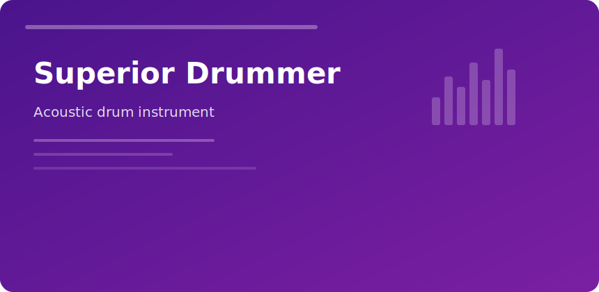

  

  

## Superior Drummer

> Multi-channel acoustic drums for producers who want real rooms, not plastic hits.

### Signal path

1. Choose kit expansion
2. Map MIDI articulations
3. Blend close/ OH / room channels
4. Print stems or stay inside the mixer

### Feature highlights

| Area | Detail |
|------|--------|
| Mixing | Per-instrument faders, sends, bleed control |
| Grooves | MIDI packs with velocity layers |
| Rooms | Convolution spaces with adjustable mic pairs |

**Best for:** rock, metal, pop, cinematic percussion beds.

**DAW tip:** Freeze the instrument only after you commit mic balances—re-opening multi-outs is slower than re-rendering stems.

superior drummer toontrack vst drums acoustic production download
